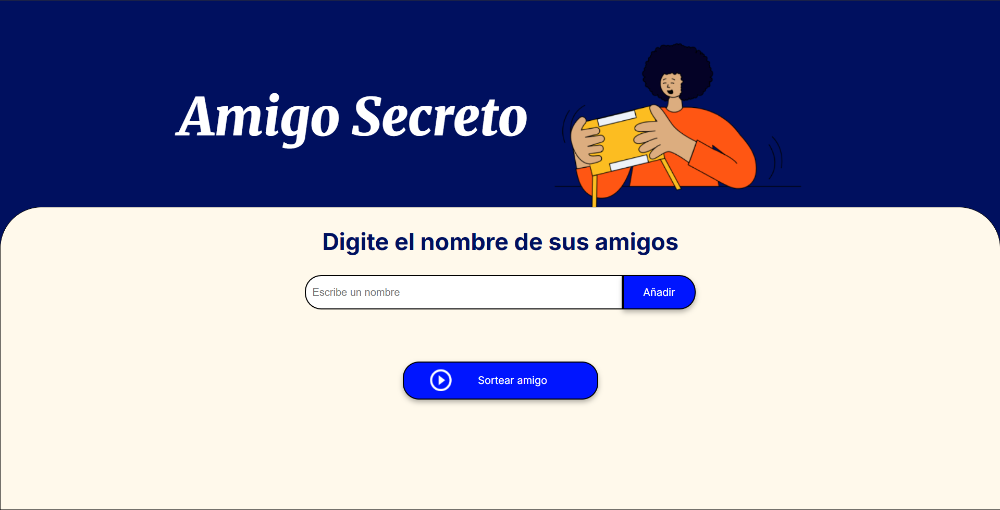

# 🎁 Amigo Secreto

Aplicación web simple para gestionar un sorteo de amigo secreto. Permite ingresar nombres de participantes, mostrarlos en pantalla y elegir aleatoriamente a uno de ellos.

---

## 📌 Funcionalidades

- Agregar nombres de amigos.
- Mostrar lista de amigos en pantalla.
- Seleccionar un amigo al azar con el boton "Sortear Amigo".

---

## 🚀 Cómo usar

### 🔧 Requisitos

No requiere instalación ni dependencias externas. Solo necesitás un navegador moderno.

### ▶️ Ejecutar el proyecto

1. Cloná este repositorio:
   ```bash
   git clone https://github.com/maylimachi/challenge-amigo-secreto_esp-main.git

## 🗂️ Estructura del proyecto ``` amigo-secreto/ ├── index.html ├── style.css ├── script.js ├── assets/ │ ├── amigo-secreto.png │ ├── logo.png │ ├── play_circle_outline.png │ └── preview.png └── README.md ```

## 📸 Captura del Proyecto



## 💻 Estado del proyecto
Proyecto en desarrollo activo.

## 🛠️ Tecnologías utilizadas  
- HTML  
- CSS  
- JavaScript 

## 👩‍💻 Desarrolladora 
- Mayra Joselin Limachi Callisaya